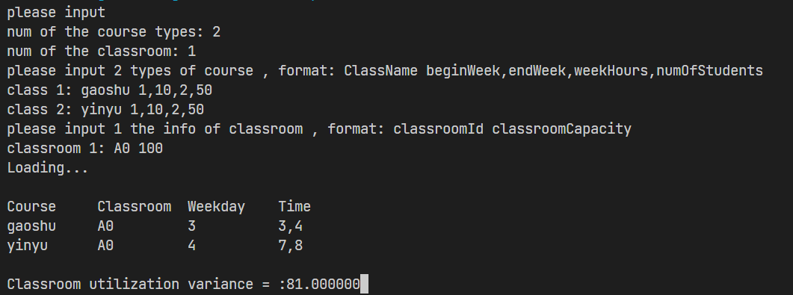

# 基于遗传算法的排课程序

## 简介

项目用CMake作为构建工具，实现了作业要求的排课算法。

## 项目结构

```
- build 
  |-makefile (项目构建文件)
  |-example.exe (可执行文件)

- project (项目源码文件夹)
  |-include 
    |-Course.h (课程类)
    |-GeneticAlgorithm.h (遗传算法基类)
    |-RandomNum.h (随机数生成类)
    |-Schedule.h (课表类)
    |-ScheduleManager.h（排课算法类）
  |-src
  	|-Course.cpp （课程类实现）
  	|-Schedule.cpp (课表类实现)
  	|-ScheduleManager.h (排课算法类实现)
  |-test.cpp （测试类）
```

## 使用

### 输入

运行程序后，会提示输入课程种类数n、教室数m

接下来n行输入课程信息，格式为：课程ID 起始周，结束周，每周学时（为偶数），学生人数

​	如：高数 1，10，4，50

接下来m行输入教室信息，格式为：教室ID 教室容量

​	如：A0 100

### 输出

程序会按时间顺序输出课程规划结果，并输出教室利用率方差

如果无法完成排课，则输出 ： No Solution

## 运行效果

